# Deep Learning for Natural Language Processing
This repo contains code for my experiments in Deep Learning for NLP. Where possible, I'll try to provide a direct link to a Colab Notebook. I'll be using PyTorch.

For feedback, feel free to reach me on: '{}@{}.com'.format('abhimanyu.talwar1', 'gmail')

# List of Experiments
|**Index**|**Experiment**|**Notebook**|
|---------|--------------|------------|
|1.| [Simple LSTM based Language Model with Beam Search](#Simple-LSTM-based-Language-Model-with-Beam-Search) | ([Colab Notebook](https://colab.research.google.com/drive/1qv9-LVdIe0boX2HxHLl-zov1NSErif-T "Language Model with Beam Search")) |
|2.| [Visualization of Layer Activation Distribution with & without BatchNorm](#Visualization-of-Layer-Activation-Distribution-with-and-without-BatchNorm) | ([Colab Notebook](https://colab.research.google.com/drive/1_glfmBfFWiqKbXAcjXEMngIZC8af8UtC "Visualize Activation Distributions with and without BatchNorm")) |
|3.| [Visualizing BERT Attention for SQuAD](#Visualizing-BERT-Attention-for-SQuAD) | ([Colab Notebook](https://colab.research.google.com/drive/1Xph-1GLUf4BRzCD9UXWY7EphRi2t9cBj)) |
|4.| [Simple QandA on Wikipedia using BERT](#Simple-QandA-on-Wikipedia-using-BERT) | ([Colab Notebook](https://colab.research.google.com/drive/1LrsfERlQcSvU89j5WyabshyOnZN8DNGD)) |
|5.| [Table Detection in Documents](#-Table-Detection-in-Documents) | ([Colab Notebook](https://colab.research.google.com/drive/1RNO86XZPjpKxHlRTGso4PQiYD7qgzFXZ)) |

# Experiment Details
## Simple LSTM based Language Model with Beam Search
* My implementation of a simple LSTM based language model with Beam Search (for sentence generation), trained on the WikiText-2 dataset.
* I used this language model to see if there is any bias in the underlying dataset. I started with the seed words 'he' and 'she' and sampled random sentences starting with these seedwords (see below). I observer that sentences beginning with 'he' were more or less about sports, and those beginning with 'she' were about music.

	

		
	

## Visualization of Layer Activation Distribution with and without BatchNorm
* Inspired by the paper [_How Does Batch Normalization Help Optimization?_](https://arxiv.org/abs/1805.11604), this notebook trains a VGG-11 architecture on CIFAR-10 and compares layer activation distributions with and without BatchNorm. I observe activations of Layer 10 of the original VGG11 network (the one which does not use BatchNorm).

* **Distributional stability of activations is similar across epochs, BN or no BN**: The plots below show disitribution of activations of Layer 10, with and without using BatchNorm (see notebook for code). I do observe a slight shift in the distribution (without BatchNorm) between epochs 0-10, however it does not seem severe (sorry for not being precise!).

  Santurkar et. al do note in the paper that the "difference in disitributional stability [...] seems to be marginal."

	

		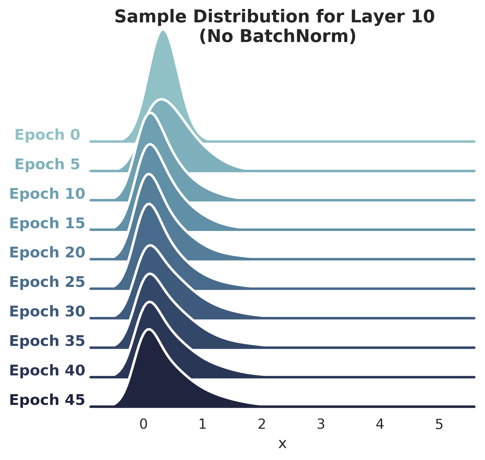
		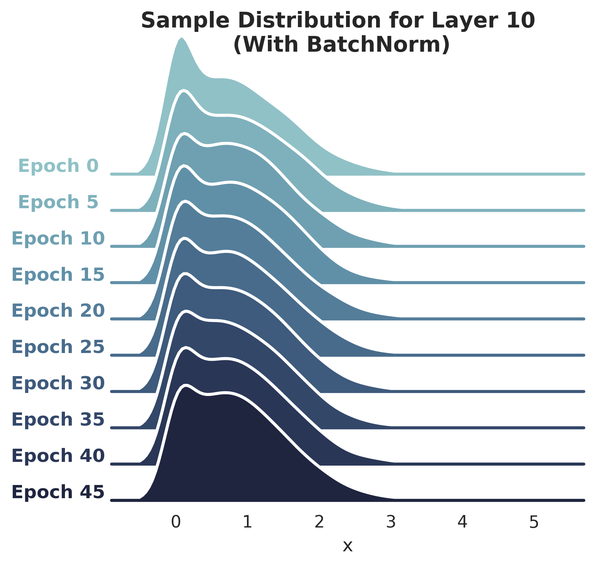
	

* **BN speeds up training even if distribution stabilization effect is suppressed:** Borrowing from the authors' experiments, I injected random Gaussian noise *after* the first BatchNorm layer which precedes Layer 10, with the intent of destabilizing the activation distribution again. The plots below show the impact of this noise on distribution of Layer 10 activations (for networks with and without BatchNorm).

	

		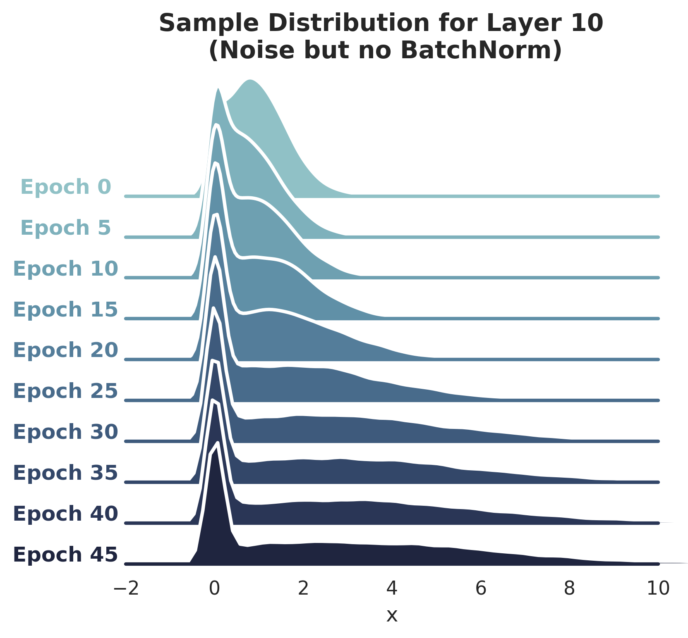
		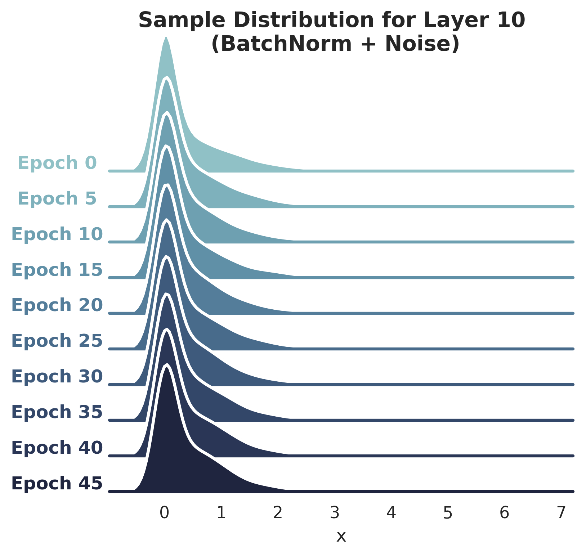
	

  The plot below shows training performance (loss and accuracy for train/validation sets). If the hypothesis is that BatchNorm improves training by stabilizing activation distributions, then that seems somewhat dispelled by this plot. The blue lines plot the regime where I introduced noise *after* the BatchNorm layer, to destabilize activations. We can observe that even after introducing noise, training accuracy improved at a faster pace, than in the case of the black line, which plots the vanilla regime (no noise and no BatchNorm), at least for the first 15 epochs or so.

  	

		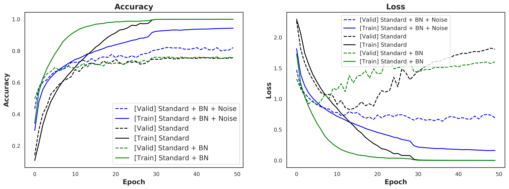
	

* **Does mere whitening of a layer's outputs suffice for stabilizing activation distribution?** Authors Ioffee and Szegedy note in their [original BatchNorm paper](https://arxiv.org/abs/1502.03167) that mere whitening of a layer's activations does not work. They describe a toy example in which a single layer adds an intercept (which is learned) to its inputs, and then normalizes the output by subtracting the mean over the outputs. They explain that if the gradient calculation does not take this normalization into account, then the layer's output and correspondingly the loss would never change even as the intercept value continues to increase. I have reproduced that toy example in my Colab Notebook. The plot below shows the result and confirms that the loss doesn't change even as the intercept continues to increase.
	

		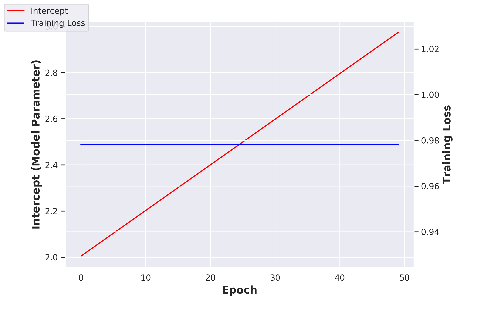
	

## Visualizing BERT Attention for SQuAD
* Visualize [BERT's](https://arxiv.org/abs/1810.04805) attention of a Question over Question+Context from the [SQuAD 2.0](https://rajpurkar.github.io/SQuAD-explorer/explore/v2.0/dev/) dataset. An example Context and Question pair from the Validation set:
<strong>Context:</strong>
<blockquote>
The Normans (Norman: Nourmands; French: Normands; Latin: Normanni) were the people who in the 10th and 11th centuries gave their name to Normandy, a region in France. They were descended from Norse ("Norman" comes from "Norseman") raiders and pirates from Denmark, Iceland and Norway who, under their leader Rollo, agreed to swear fealty to King Charles III of West Francia. Through generations of assimilation and mixing with the native Frankish and Roman-Gaulish populations, their descendants would gradually merge with the Carolingian-based cultures of West Francia. The distinct cultural and ethnic identity of the Normans emerged initially in the first half of the 10th century, and it continued to evolve over the succeeding centuries.
</blockquote>

<strong>Question:</strong>
<blockquote>
In what country is Normandy located?
</blockquote>

  I have used the BERT-Base model which has 12 Layers and each Layer has a Multi-head Attention mechanism with 12 heads. The figure below shows the attenion visualization for Layer 10, Head 1. The darker the color, the closer the attention weight is to 1.0. The answer to this Question is "France". While each of the 144 Attention Heads in this model may be attending to different parts of the input, at least in this case one can observe that the tokens "what country" are attending to "France" in the Context text. I need to do further work on interpretation of individual Attention Heads.

  

  	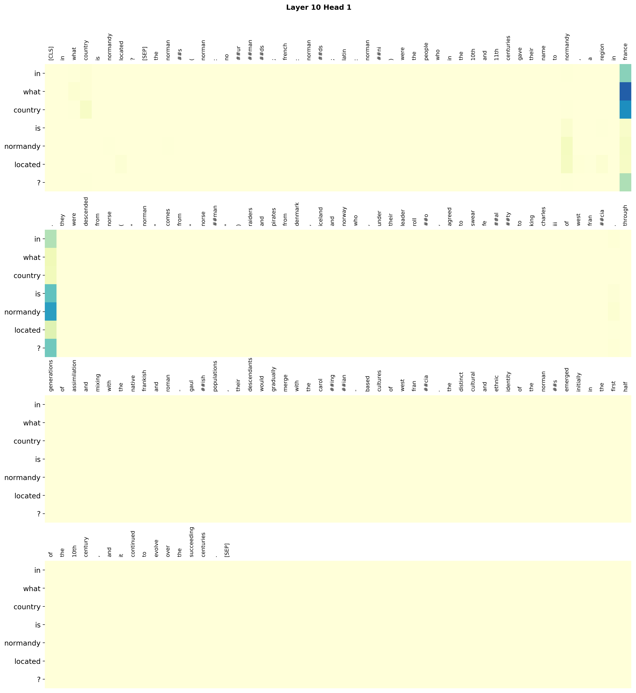
  

* **Credits**: A big shoutout to [Hugging Face](https://github.com/huggingface/pytorch-pretrained-BERT/). I used their BERT implementation and associated training code. My contribution was finetuning BERT on SQuAD 2.0, and writing the code for extracting/visualizing attention.

## Simple QandA on Wikipedia using BERT
* I use a user's question to query Wikipedia, and use the top article's first few lines as context for a BERT fine-tuned on SQuAD 2.0, to answer the user's question. Some (good) results below: 

  

  	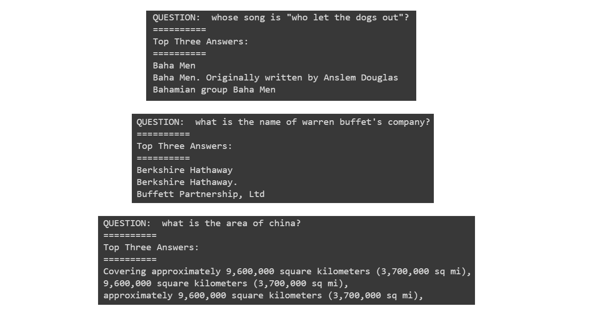
  

* **Credits**: Again, thanks to [Hugging Face](https://github.com/huggingface/pytorch-pretrained-BERT/), whose pre-trained BERT implementation and associated training code I have used. Thanks to [Wikipedia](https://www.wikipedia.org/), for providing all the answers. My contribution was finetuning BERT on SQuAD 2.0, and writing the code for fetching and processing articles from Wikipedia for feeding them to BERT.

## Table Detection in Documents
* This is a rather crude project (with a HUGE scope for further work) which attempts to detect tables inside a document page. The bigger goal is to eventually develop a detection+recognition system which can transcribe all tables inside a document in a proper format. I used a CNN architecture (similar to that proposed in [EAST: An Efficient and Accurate Scene Text Detector](https://arxiv.org/abs/1704.03155)) for this task. I trained this network on a synthetic dataset created by me to mimic real financial documents. While this work is FAR from being perfect, I still wanted to put it out there as a first attempt towards a challenging goal.

* **Some Results:**
 * **Training Set:** These are from the synthetic dataset of 20k images that I created by fusing together elements of four types: (1) text, (2) tables, (3) plots, (4) random images.

  

  	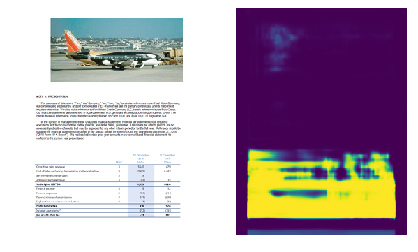
  	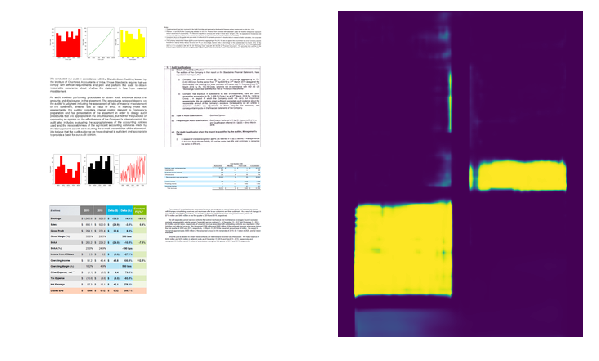
  

 * **Test Set**

  

  	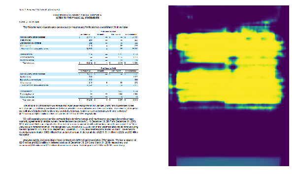
  	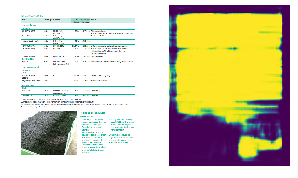
  

